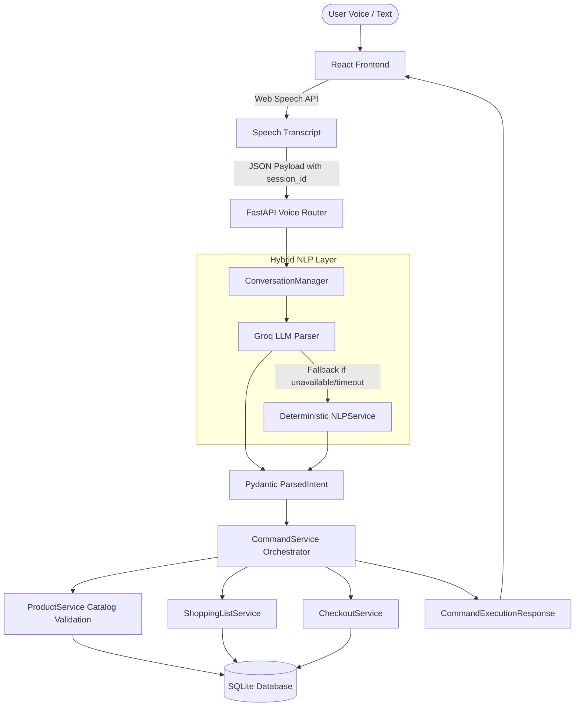

# Voice Command Shopping Assistant

A voice-first grocery shopping assistant built with **React**, **FastAPI**, **SQLAlchemy**, and a **hybrid Conversational AI architecture**. The application enables users to manage shopping lists, explore catalog products, receive recommendations, and execute grocery checkout using natural voice or text commands.

The system natively supports **English (`en-US`)**, **Malayalam (`ml-IN`)**, and **bilingual English/Malayalam code-switching**, ensuring that Malayalam speakers can mix common English grocery and confirmation keywords without switching settings or breaking intent detection.

All AI interpretation is governed by a **deterministic safety layer** that strictly validates product catalog availability, enforces atomic zero-mutation transactions, and requires explicit multi-turn confirmation before placing orders. All monetary values across the application are standardized in **Indian Rupees (INR / ₹)**.

---

## Table of Contents

1. [Overview](#1-overview)
2. [Key Features](#2-key-features)
3. [Safety Architecture](#3-safety-architecture)
4. [Conversational AI Architecture](#4-conversational-ai-architecture)
5. [Multilingual Architecture](#5-multilingual-architecture)
6. [Conversation & Session Management](#6-conversation--session-management)
7. [Checkout Safety](#7-checkout-safety)
8. [Catalog Validation](#8-catalog-validation)
9. [Currency](#9-currency)
10. [Technology Stack](#10-technology-stack)
11. [System Architecture](#11-system-architecture)
12. [Project Structure](#12-project-structure)
13. [API Documentation](#13-api-documentation)
14. [Example Commands](#14-example-commands)
15. [Setup Instructions](#15-setup-instructions)
16. [Environment Variables](#16-environment-variables)
17. [Testing](#17-testing)
18. [Security & Reliability](#18-security--reliability)
19. [Accessibility & Responsive Design](#19-accessibility--responsive-design)
20. [Error Handling & Edge Cases](#20-error-handling--edge-cases)
21. [Example End-to-End Flow](#21-example-end-to-end-flow)
22. [Design Decisions](#22-design-decisions)
23. [Limitations](#23-limitations)
24. [Future Improvements](#24-future-improvements)
25. [Development & Git Status](#25-development--git-status)
26. [License](#26-license)

---

## 1. Overview

Grocery shopping via voice requires high accuracy, speed, and absolute state safety. Unintended item additions or unauthorized checkouts caused by speech misinterpretations can result in poor user experience or unwanted purchases.

**Voice Command Shopping Assistant** solves this by separating **Language Understanding** from **Domain Execution**:
- **Conversational Understanding**: Uses Groq LLM (`llama-3.3-70b-versatile`) with context memory to interpret natural speech, conversational phrasing, self-corrections, and code-switching.
- **Deterministic Domain Execution**: A rule-based backend validates every product against an authoritative local catalog, manages shopping list CRUD, computes totals from database prices, and guarantees zero-mutation atomicity.

Users can interact using the Web Speech API microphone or manual text input on desktop and mobile devices.

---

## 2. Key Features

### Voice Shopping
- **Bilingual Voice Input**: Native recognition for **English (`en-US`)** and **Malayalam (`ml-IN`)**.
- **Code-Switching**: Mix English keywords (e.g. `"milk"`, `"checkout"`, `"confirm"`, `"yes"`) inside Malayalam sentences without changing language dropdowns.
- **Web Speech API**: In-browser real-time speech recognition with interim and final transcript formatting.
- **Manual Text Fallback**: Accessible text input for typing commands.

### Natural Language Understanding
- **Intent Extraction**: Recognizes `ADD_ITEM`, `REMOVE_ITEM`, `UPDATE_QUANTITY`, `SEARCH_PRODUCT`, `SHOW_LIST`, `CLEAR_LIST`, `GET_SUGGESTIONS`, `CHECKOUT`, `CONFIRM_ORDER`, `CANCEL_ORDER`, and `UNKNOWN`.
- **Entity & Unit Parsing**: Parses quantities (digits `2` / `<ctrl42>` and words `"two"` / `"രണ്ട്"`) and units (`"bottles"`, `"kg"`, `"packets"`, `"കുപ്പി"`, `"പാക്കറ്റ്"`).
- **Compound Commands**: Parses multiple items in a single sentence (e.g. `"add 2 bottles of milk and 3 apples"`).
- **Self-Correction Handling**: Resolves in-sentence revisions (e.g. `"add milk, actually bread"` -> adds only bread).
- **Negation Safety**: Blocks negated actions (e.g. `"don't add milk"`, `"checkout വേണ്ട"`).

#### Examples
- **English**: `"Add 2 bottles of milk and 6 eggs"`
- **Malayalam**: `"രണ്ട് കുപ്പി പാൽ ചേർക്കൂ"`
- **Mixed Code-Switching**: `"2 bottles milk ചേർക്കൂ"`

### Product Discovery
- **Catalog Search**: Case-insensitive search by product name, category, or brand.
- **Parametric Filtering**: Search products by price range (e.g. `"under ₹100"`, `"between ₹50 and ₹150"`).
- **Recommendations**: Deterministic purchase history ranking combined with seasonal bonuses.
- **Substitutes**: Suggests in-stock alternative products when a requested item is out of stock.

### Shopping List
- **Idempotent Addition**: Merges duplicate item quantities automatically.
- **Quantity Updating**: Explicitly sets or modifies item counts.
- **Catalog Validation**: Only valid store catalog products can be added.
- **Atomic Compound Validation**: If any item in a multi-item command is invalid, **0 items** are added.

### Checkout
- **Two-Phase Checkout**:
  1. User requests checkout -> System generates non-mutating preview with database-authoritative totals.
  2. System requests explicit confirmation -> User says `"yes"`, `"confirm"`, or `"അതെ"`.
  3. System validates cart hash and TTL session -> Places order atomically, completes shopping list items, and records transaction snapshot.

### Order History
- **Transaction Logs**: View past orders with unique order numbers and timestamps.
- **Item Snapshots**: Stores historical item prices, quantities, units, and line item totals in **₹ (INR)**.

### Catalog
- Contains **239 products** across **20 supermarket categories** (Dairy, Bakery, Produce, Grains, Pulses, Beverages, Snacks, Spices, Meat, Seafood, Frozen, Personal Care, Household, Baby, Pet, etc.).
- Idempotent seeding populates catalog items, prices, brands, sizes, availability, and substitute maps at startup.

---

## 3. Safety Architecture

```
User Voice / Text
       │
       ▼
Web Speech API / Frontend
       │
       ▼
Voice API (/api/v1/voice/execute)
       │
       ▼
Conversation Manager (Session Context & History)
       │
       ├─────────────────────────────────────────┐
       ▼                                         ▼
Groq LLM Intent Parser                  Deterministic NLP Fallback
       │                                         │
       └────────────────────┬────────────────────┘
                            ▼
                    Structured Intent
                            │
                            ▼
             Catalog Validation & Resolution
                            │
                            ▼
                Atomic Zero-Mutation Gate
                            │
                            ▼
                     Command Service
                            │
                            ▼
                  SQLite Database (Storage)
```

### Trust Boundary Rules
- **LLM Non-Capabilities**: The LLM **cannot** mutate the database directly, set product prices, bypass catalog validation, skip confirmation prompts, or create orders independently.
- **Deterministic Backend Authority**: The backend controls database transactions, catalog resolution, price calculations, cart hash checks, pending checkout sessions, and transaction atomicity.

> **Core Principle**: *"LLM for understanding, deterministic services for authorization and execution."*

---

## 4. Conversational AI Architecture

The AI layer (`backend/app/ai/`) provides context-aware parsing with a deterministic fallback:
- **Groq LLM Client** (`llm_client.py`): Uses `llama-3.3-70b-versatile` with JSON structured outputs (`response_format={"type": "json_object"}`).
- **AI Intent Parser** (`intent_parser.py`): Maps raw transcripts into Pydantic `ParsedIntent` objects using recent conversation turn history.
- **Response Generator** (`response_generator.py`): Formats natural text responses while preserving exact numbers and INR currency values.
- **Conversation Manager** (`conversation_manager.py`): Maintains in-memory turn history, pending clarifications, and pending checkout states per session.
- **Deterministic NLP Fallback** (`nlp_service.py`): Automatically handles intent parsing if the LLM API key is unconfigured, unavailable, times out (>4.0s), or returns malformed JSON.

---

## 5. Multilingual Architecture

Multilingual logic is decoupled into language profiles (`backend/app/services/language_profiles.py`):

| Component | English (`en-US`) | Malayalam (`ml-IN`) |
|---|---|---|
| **Add Triggers** | `add`, `buy`, `need`, `put`, `get` | `ചേർക്കൂ`, `ചേർക്കുക`, `വാങ്ങണം`, `വാങ്ങൂ`, `വേണം` |
| **Number Words** | `one`, `two`, `three`, `half` | `ഒന്ന്`, `രണ്ട്`, `മൂന്ന്`, `അര`, `ഒരു` |
| **Units Map** | `bottle` -> `bottles`, `kg` -> `kg` | `കുപ്പി` -> `bottles`, `പാക്കറ്റ്` -> `packets`, `കിലോ` -> `kg` |
| **Product Aliases** | `milk` -> `whole milk`, `apples` -> `gala apples` | `പാൽ` -> `milk`, `ആപ്പിൾ` -> `apples`, `ബ്രെഡ്` -> `bread` |
| **Negation Markers**| `don't add`, `don't buy`, `don't checkout` | `വേണ്ട`, `ചേർക്കണ്ട`, `ചെയ്യണ്ട`, `ഓർഡർ വേണ്ട` |
| **Corrections** | `actually`, `sorry`, `no`, `I mean` | `അല്ല`, `സോറി`, `പകരം` |
| **Checkout / Confirm** | `checkout`, `place the order`, `yes`, `confirm` | `checkout ചെയ്യൂ`, `ഓർഡർ place ചെയ്യൂ`, `അതെ`, `ശരി` |

---

## 6. Conversation & Session Management

To ensure multi-turn conversation flows function across HTTP requests, the frontend and backend maintain a persistent session lifecycle:

1. **Frontend Session ID**: [`frontend/src/services/api.ts`](file:///e:/voice-command-shopping-assistant/frontend/src/services/api.ts) generates a stable `session_id` (`crypto.randomUUID()`) stored in browser `sessionStorage` (`voice-shopping-session-id`).
2. **Backend `ConversationManager`**: Retains session turn history, pending item clarifications, and pending checkout states in an application-scoped singleton map.
3. **Cart Hash & Expiration**:
   - `CHECKOUT` stores a cart hash snapshot with a **5-minute TTL** (`expires_at = now + 300s`).
   - If cart items are modified (`ADD_ITEM`, `REMOVE_ITEM`, `UPDATE_QUANTITY`, `CLEAR_LIST`), `CommandService.invalidate_pending_checkout` clears the pending checkout to prevent stale orders.

---

## 7. Checkout Safety

- **Non-Mutating Preview**: Saying `"checkout"` generates a preview of item counts and total costs without modifying cart contents or creating orders.
- **Explicit Confirmation**: Order creation strictly requires intent `CONFIRM_ORDER` (`"yes"`, `"confirm"`, `"place it"`, `"അതെ"`, `"ശരി"`) while a valid `pending_checkout` exists under the same `session_id`.
- **Confirmation Without Pending Checkout**: Saying `"yes"` without a pending checkout preview is safely rejected (`success=False`).
- **Cart Mutation Invalidation**: Modifying list items after requesting checkout invalidates confirmation, forcing the user to review a fresh preview.
- **Replay Protection**: The pending checkout state is deleted immediately after order placement, preventing duplicate confirmations from placing duplicate orders.

---

## 8. Catalog Validation

The local store database is authoritative for product resolution:
- **Exact & Alias Resolution**: Items are resolved via canonical product names or profile aliases (e.g. `"പാൽ"` -> `"milk"` -> `Whole Milk`).
- **Ambiguity Detection**: If a generic query matches multiple products without an exact alias match, the backend returns `success=False` with candidate suggestions (e.g. `"Did you mean Whole Milk or Toned Milk?"`).
- **Zero Partial Execution**: Compound commands like `"add milk and unicorn juice"` are validated atomically. Because `"unicorn juice"` is invalid, **0 items** are added to the list.

---

## 9. Currency

- **Standard**: All monetary values are strictly formatted in **Indian Rupees (INR / ₹)**.
- **Frontend Utility**: [`frontend/src/utils/currency.ts`](file:///e:/voice-command-shopping-assistant/frontend/src/utils/currency.ts) formats values using `Intl.NumberFormat('en-IN', { style: 'currency', currency: 'INR' })`.
- **Authoritative Sourcing**: Prices are computed strictly from database records (`Product.price`), never invented by LLM completions.

---

## 10. Technology Stack

### Frontend
- **Framework**: React 18
- **Language**: TypeScript 5.4
- **Build Tool**: Vite 5.2
- **Styling**: Vanilla CSS (Tailwind-free, responsive design, custom variables)
- **Speech**: Browser Web Speech API (`SpeechRecognition` / `webkitSpeechRecognition`)

### Backend
- **Framework**: FastAPI 0.110
- **Language**: Python 3.13
- **Data Validation**: Pydantic 2.6
- **ORM & DB**: SQLAlchemy 2.0 with SQLite (`shopping_assistant.db`)
- **Server**: Uvicorn

### AI & NLP
- **LLM Engine**: Groq API (`llama-3.3-70b-versatile`)
- **Deterministic NLP**: Rule-based regex intent parser & LanguageProfile pipeline

---

## 11. System Architecture



---

## 12. Project Structure

```text
voice-command-shopping-assistant/
├── backend/
│   ├── app/
│   │   ├── ai/                      # AI Layer: Groq client, intent parser, prompts, conversation manager
│   │   │   ├── conversation_manager.py
│   │   │   ├── intent_parser.py
│   │   │   ├── llm_client.py
│   │   │   ├── prompts.py
│   │   │   └── response_generator.py
│   │   ├── api/                     # FastAPI v1 routers
│   │   │   └── v1/
│   │   │       ├── checkout.py
│   │   │       ├── items.py
│   │   │       ├── orders.py
│   │   │       ├── products.py
│   │   │       ├── suggestions.py
│   │   │       └── voice.py
│   │   ├── core/                    # Config, DB connection, catalog seed data
│   │   │   ├── config.py
│   │   │   ├── database.py
│   │   │   └── seed_data.py
│   │   ├── models/                  # SQLAlchemy ORM database models
│   │   │   ├── order.py
│   │   │   ├── product.py
│   │   │   ├── shopping_history.py
│   │   │   └── shopping_list.py
│   │   ├── schemas/                 # Pydantic schemas for requests & responses
│   │   │   ├── checkout.py
│   │   │   ├── command.py
│   │   │   ├── intent.py
│   │   │   ├── product.py
│   │   │   ├── shopping_list.py
│   │   │   └── suggestion.py
│   │   └── services/                # Business logic, NLP parser, domain services
│   │       ├── categorization_service.py
│   │       ├── checkout_service.py
│   │       ├── command_service.py
│   │       ├── language_profiles.py
│   │       ├── nlp_service.py
│   │       ├── product_service.py
│   │       ├── recommendation_service.py
│   │       └── shopping_list_service.py
│   │   └── main.py                  # FastAPI application entrypoint & startup seed
│   ├── tests/                       # Pytest test suite (216 tests)
│   └── requirements.txt
├── frontend/
│   ├── src/
│   │   ├── components/              # React components (VoiceAssistant, ShoppingList, etc.)
│   │   ├── hooks/                   # Custom Web Speech hook (useSpeechRecognition)
│   │   ├── services/                # API service & Voice service configuration
│   │   ├── types/                   # TypeScript interfaces
│   │   ├── utils/                   # Currency formatters & session management
│   │   ├── App.tsx
│   │   ├── index.css
│   │   └── main.tsx
│   ├── package.json
│   ├── tsconfig.json
│   └── vite.config.ts
└── README.md
```

---

## 13. API Documentation

Swagger / OpenAPI documentation is automatically available at `http://localhost:8000/docs`.

### Key Endpoints

| Category | Method | Endpoint | Purpose |
|---|---|---|---|
| **Voice** | `POST` | `/api/v1/voice/parse` | Non-mutating intent parsing from text transcript |
| **Voice** | `POST` | `/api/v1/voice/execute` | Parses and executes command orchestration |
| **Shopping List** | `GET` | `/api/v1/items` | Retrieves active shopping list items |
| **Shopping List** | `POST` | `/api/v1/items` | Adds or updates an item on the shopping list |
| **Shopping List** | `PUT` | `/api/v1/items/{id}` | Updates quantity or completion status |
| **Shopping List** | `DELETE` | `/api/v1/items/{id}` | Removes single item from list |
| **Shopping List** | `DELETE` | `/api/v1/items` | Clears all items from shopping list |
| **Products** | `GET` | `/api/v1/products` | Searches catalog by query, category, brand, or price range |
| **Suggestions** | `GET` | `/api/v1/suggestions` | Retrieves history-ranked & seasonal recommendations |
| **Checkout** | `GET` | `/api/v1/checkout/preview` | Generates non-mutating checkout preview total |
| **Checkout** | `POST` | `/api/v1/checkout` | Atomically completes order and clears shopping list |
| **Orders** | `GET` | `/api/v1/orders` | Retrieves transaction order history |
| **Orders** | `GET` | `/api/v1/orders/{id}` | Retrieves specific order details and item snapshots |
| **Health** | `GET` | `/health` | Returns application health status |

---

## 14. Example Commands

| User Command | Intent | Result / Behavior |
|---|---|---|
| `"add milk"` | `ADD_ITEM` | Adds 1.0 Whole Milk to list |
| `"add 2 bottles of milk"` | `ADD_ITEM` | Adds 2.0 bottles Whole Milk to list |
| `"add milk and bread"` | `ADD_ITEM` | Adds Whole Milk and Whole Wheat Bread |
| `"രണ്ട് കുപ്പി പാൽ ചേർക്കൂ"` | `ADD_ITEM` | Adds 2.0 bottles Whole Milk (Malayalam) |
| `"2 bottles milk ചേർക്കൂ"` | `ADD_ITEM` | Code-switched addition of 2.0 bottles Whole Milk |
| `"remove milk"` | `REMOVE_ITEM` | Deletes Whole Milk from active list |
| `"change milk to 3"` | `UPDATE_QUANTITY` | Updates Whole Milk quantity to 3.0 |
| `"clear my list"` | `CLEAR_LIST` | Deletes all list items |
| `"find toothpaste under ₹50"` | `SEARCH_PRODUCT` | Searches catalog with max price filter ₹50.00 |
| `"checkout"` | `CHECKOUT` | Generates non-mutating total preview in **₹** |
| `"checkout ചെയ്യൂ"` | `CHECKOUT` | Generates preview for Malayalam command |
| `"yes"` | `CONFIRM_ORDER` | Confirms pending checkout and places order |
| `"അതെ"` | `CONFIRM_ORDER` | Malayalam confirmation of pending order |

---

## 15. Setup Instructions

### Prerequisites
- **Python**: Version 3.10 or higher (3.13 recommended)
- **Node.js**: Version 18 or higher & `npm`

### 1. Backend Setup

```bash
cd backend

# Create virtual environment
python -m venv venv

# Activate virtual environment
# On Windows:
venv\Scripts\activate
# On macOS/Linux:
# source venv/bin/activate

# Install dependencies
pip install -r requirements.txt

# (Optional) Set Groq API key for AI features
set GROQ_API_KEY=your_groq_api_key_here

# Start backend server
uvicorn app.main:app --reload --port 8000
```
*The database (`shopping_assistant.db`) will automatically initialize and seed 239 catalog products upon startup.*

### 2. Frontend Setup

```bash
cd frontend

# Install npm dependencies
npm install

# Start Vite dev server
npm run dev
```
*Access the application in your browser at `http://localhost:5173`.*

---

## 16. Environment Variables

Configure environment variables in `backend/.env` or system environment:

| Variable | Default Value | Purpose |
|---|---|---|
| `DATABASE_URL` | `sqlite:///./shopping_assistant.db` | SQLAlchemy SQLite database file connection string |
| `GROQ_API_KEY` | `""` | API key for Groq LLM inference service |
| `GROQ_MODEL` | `llama-3.3-70b-versatile` | Groq model selection |
| `ENABLE_AI_PARSER` | `true` | Enables AI intent parsing with fallback to NLPService |
| `ENABLE_AI_RESPONSES` | `true` | Enables natural AI response generation |

---

## 17. Testing

### Backend Unit & Integration Tests (216 Tests)

```bash
cd backend
python -m pytest -v
```

#### Test Suite Structure
- `test_ai_layer.py`: LLM intent parsing, fallback, response generator
- `test_api_endpoints.py`: FastAPI routes & JSON schema responses
- `test_bilingual_codeswitching.py`: Multilingual intent extraction & code-switching
- `test_checkout.py`: Two-phase checkout preview & atomic order placement
- `test_command_service.py`: Command service orchestration & catalog guards
- `test_compound_commands.py`: Multi-item extraction, atomicity, & compound connectors
- `test_expanded_catalog.py`: Catalog size (~239 products), unique resolution, & Hindi removal
- `test_malayalam_nlp.py`: Native Malayalam command parsing & normalization
- `test_nlp.py`: Deterministic NLP intent variations & punctuation normalization
- `test_recommendations.py`: Purchase history ranking & seasonal boost logic
- `test_search.py`: Parametric catalog search & substitute recommendations
- `test_session_continuity.py`: Persistent session IDs, TTL expiration, & cart mutation invalidation

### Frontend TypeScript & Build Verification

```bash
cd frontend

# Type-check TypeScript code
npx tsc --noEmit

# Test production bundle build
npm run build
```

---

## 18. Security & Reliability

- **No Secret Leaks**: Zero API keys or credentials committed in source code or repository history.
- **Input Sanitization**: Pydantic models validate and sanitize all JSON request payloads.
- **SQL Injection Prevention**: SQLAlchemy parameterized queries isolate raw SQL execution.
- **Atomic Operations**: All multi-item additions and order placements run inside database transactions. Failed steps cause automatic rollback.

---

## 19. Accessibility & Responsive Design

- **Touch Targets**: Minimum **44px × 44px** touch targets for mobile accessibility (`touch-targets.css`).
- **Keyboard Navigation**: Full keyboard tab order and `Escape` key handlers on modals.
- **ARIA Live Regions**: `aria-live="polite"` regions announce recognized speech, execution status, and alerts.
- **Responsive Layout**: Flexbox/Grid CSS layout adaptable to mobile, tablet, and desktop viewports.

---

## 20. Error Handling & Edge Cases

- **Unrecognized Products**: Clear message returned (`"I couldn't find 'unicorn juice' in our store catalog. Nothing was added."`).
- **Ambiguous Queries**: Returns product suggestions (`"Did you mean Whole Milk or Toned Milk?"`).
- **Out-of-Stock Items**: Suggests available substitutes during search or checkout preview.
- **Expired Confirmations**: Rejects stale confirmation attempts after 5 minutes, requesting a fresh checkout review.
- **Cart Mutation Interruption**: Adding or removing items after checkout preview invalidates pending confirmation to prevent accidental purchases.

---

## 21. Example End-to-End Flow

### English Flow
1. **User Voice**: `"Add 2 bottles of milk and 1 loaf of bread"`
   - *Backend*: Validates `Whole Milk` and `Whole Wheat Bread`. Adds both to list.
   - *Assistant*: `"Added 2 bottles of Whole Milk and 1 Whole Wheat Bread to your shopping list."`
2. **User Voice**: `"Checkout"`
   - *Backend*: Generates preview. Calculates total: **₹164.00**.
   - *Assistant*: `"Your total is ₹164.00 for 2 items. Would you like me to place the order?"`
3. **User Voice**: `"Yes"`
   - *Backend*: Validates session & cart hash -> Creates Order #1001 -> Completes list items.
   - *Assistant*: `"Order #1001 placed successfully! Total: ₹164.00."`

### Malayalam / Code-Switched Flow
1. **User Voice**: `"2 bottles milk ചേർക്കൂ"`
   - *Backend*: Maps `"milk"` to `Whole Milk`. Adds 2.0 bottles.
   - *Assistant*: `"Added 2.0 bottles of Whole Milk to your shopping list."`
2. **User Voice**: `"checkout ചെയ്യൂ"`
   - *Backend*: Generates preview. Calculates total: **₹124.00**.
   - *Assistant*: `"Your total is ₹124.00 for 1 items. Would you like me to place the order?"`
3. **User Voice**: `"അതെ"`
   - *Backend*: Creates Order #1002.
   - *Assistant*: `"Order #1002 placed successfully! Total: ₹124.00."`

---

## 22. Design Decisions

- **Hybrid AI Architecture**: Combines LLM natural language flexibility with deterministic backend safety.
- **Catalog-Authoritative Pricing**: Guarantees monetary values are sourced directly from SQLite, preventing LLM price hallucination.
- **Language Profiles**: Modular language configuration isolates translation/alias rules from domain execution.
- **Persistent Session Storage**: Stores `session_id` in `sessionStorage` so multi-turn interactions (e.g. `"checkout"` -> `"yes"`) remain linked without complex user authentication.

---

## 23. Limitations

- **Browser Speech Recognition**: Web Speech API support varies by browser (best experience on Chrome / Edge).
- **Offline LLM Features**: AI-enhanced parsing requires an active Groq API key and internet access (falls back to local NLP when offline).

---

## 24. Future Improvements

- **User Accounts & Authentication**: Multi-tenant database schema with user authentication.
- **Payment Gateway Integration**: Simulated payment processing via Razorpay/Stripe APIs.
- **Address & Delivery Scheduling**: Delivery address management and time-slot selection.
- **Barcode Scanning**: Camera-based barcode scanner for instant product additions.

---


